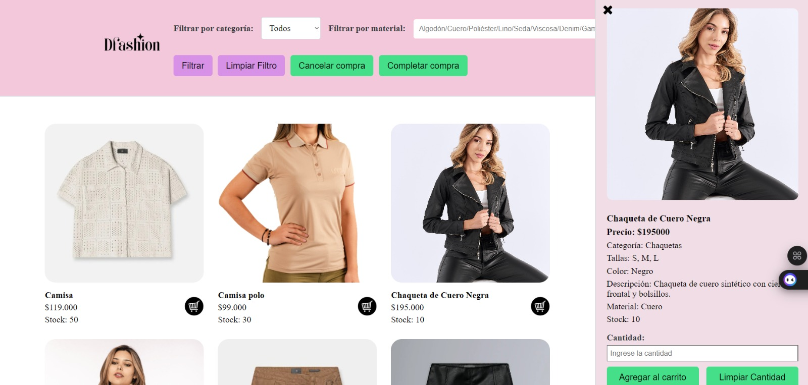

***Karen Tatiana Suarez Arroyave 441A***
# 🛍️ Dfashion

**Dfashion** es una tienda online de moda que te permite explorar, seleccionar y comprar ropa con facilidad. En **Dfashion**, tu experiencia de compra es única. Puedes filtrar productos por categoría y material, agregar artículos a tu carrito y completar la compra de manera segura y rápida, todo mientras disfrutas de una experiencia visualmente atractiva.

---

## 💇‍♀️ Motivación

La moda es mucho más que ropa; es una forma de expresión, una herramienta para superar complejos y una fuente de creatividad. En **Dfashion**, queremos ofrecerte productos que no solo te hagan ver bien, sino que también te ayuden a sentirte seguro y auténtico. Nos apasiona la idea de que cada persona puede usar la ropa como una forma de arte y originalidad, y trabajamos para que encuentres esas prendas especiales que realmente reflejan quién eres.

---

## 🎯 Funcionalidades del Proyecto

**Dfashion** ofrece una serie de funcionalidades que mejoran la experiencia de compra:

### 1. **Vista de Productos**
- **Carga inicial**: Muestra los primeros 15 productos disponibles, con la opción de cargar más automáticamente mediante **scroll infinito** a medida que el usuario hace scroll en la página.
- **Filtros avanzados**: Permite a los usuarios buscar ropa por **categoría** (camisas, chaquetas, faldas, etc.) y **material** (algodón, poliéster, lino, etc.).
- **Detalles del producto**: Cada artículo tiene su propia sección con una descripción detallada, imagen y opción para agregarlo al carrito de compras.

### 2. **Carrito de Compras**
- **Tabla interactiva**: Los usuarios pueden ver los productos seleccionados en el carrito, con información detallada sobre el nombre, categoría, material, cantidad y precio por unidad.
- **Gestión de productos**: Se pueden eliminar productos del carrito antes de proceder al pago.
- **Resumen de la compra**: El sistema calcula el total de la compra y agrega un cargo adicional por entrega (por ejemplo, $15.000).

### 3. **Proceso de Pago**
- **Formulario de pago**: Los usuarios completan su compra ingresando los detalles de su tarjeta de crédito, como el número de tarjeta, fecha de expiración, código de seguridad y nombre del titular.
- **Validación dinámica**: Se verifica que todos los datos ingresados sean correctos, mostrando mensajes de error si algún campo está vacío o tiene datos incorrectos.
- **Simulación de pago**: Utilizando **Promesas** en JavaScript, el sistema simula el procesamiento del pago, mostrando tiempos de espera y mensajes de éxito o error al completar la transacción.

---

## 🌟 Estructura del Proyecto

La aplicación tiene la siguiente estructura de archivos y carpetas:

- **`index.html`**: Página principal donde se listan los productos disponibles.
- **`carrito.html`**: Página que muestra un resumen de los productos seleccionados en el carrito y permite al usuario proceder al pago.
- **`styles.css`**: Archivo de estilos globales que aplica un diseño limpio y moderno, con una estética centrada en tonos suaves y elegantes, pensados para una experiencia agradable.
- **`app.js`**: Archivo JavaScript principal donde se maneja la lógica de la aplicación: filtros, productos, carrito de compras y validación del proceso de pago.
- **`data.js`**: Contiene los datos de los productos disponibles para la venta, organizados en un array de objetos JavaScript.

---

## 🌐 Vistas del Sistema

### 1. **Detalles de Compra**
En esta vista, el usuario puede ingresar la siguiente información básica para su compra:
- **Nombre completo**: Para identificar al comprador.
- **Dirección de envío**: Para enviar el pedido a la ubicación deseada.
- **Presupuesto máximo**: Para ajustar las opciones de compra según el límite establecido por el usuario.
- **Entrega a domicilio**: Opción para seleccionar si el pedido será enviado a la dirección proporcionada.

### 2. **Lista de Productos**
Los productos están organizados por categorías y materiales, y los usuarios pueden utilizar los filtros para encontrar la ropa que más les guste. Los productos se muestran con una imagen, nombre, precio y material, lo que permite al usuario tomar decisiones rápidas y eficientes.

### 3. **Carrito de Compras**
El carrito muestra todos los productos seleccionados, con su respectiva cantidad y precio. El total se calcula automáticamente, y el usuario tiene la opción de eliminar productos o proceder al pago.

---

## 📊 Base de Datos (Datos en JavaScript)

Los productos disponibles en **Dfashion** están almacenados en un **array de objetos JavaScript**. Cada producto contiene información detallada, como:
- **ID**: Identificador único para cada producto.
- **Nombre**: Nombre del producto.
- **Categoría**: Tipo de prenda (camisa, falda, etc.).
- **Material**: Material del que está hecho (algodón, lino, etc.).
- **Precio**: Precio unitario de la prenda.
- **Imagen**: Ruta a la imagen del producto.

Este enfoque permite manejar los datos de manera eficiente y realizar operaciones como filtrado y búsqueda con facilidad.

---

## 🚀 Tecnologías Utilizadas

- **HTML5** y **CSS3**: Para la estructura y diseño de la interfaz de usuario. Se emplea un diseño responsivo y centrado en la estética femenina y moderna.
- **JavaScript**: Para la lógica de la aplicación, incluido el manejo de formularios, el filtrado de productos, el carrito de compras y la simulación del proceso de pago.
- **Scroll infinito**: Permite una navegación más fluida, cargando más productos de manera automática conforme el usuario hace scroll hacia abajo.
- **Validación de formularios**: Los datos del formulario de pago son validados en tiempo real para garantizar su precisión antes de proceder con la transacción.
- **Promesas en JavaScript**: Simula el procesamiento de pagos, brindando una experiencia interactiva y realista con tiempos de espera y mensajes de éxito o error.
